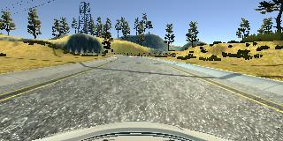

# **Behavioral Cloning Project**

## Writeup Template

**Behavioral Cloning Project**

The goals / steps of this project are the following:
* Use the simulator to collect data of good driving behavior
* Build, a convolution neural network in Keras that predicts steering angles from images
* Train and validate the model with a training and validation set
* Test that the model successfully drives around track one without leaving the road
* Summarize the results with a written report

---
## Rubric Points
**Here I will consider the [rubric points](https://review.udacity.com/#!/rubrics/432/view) individually and describe how I addressed each point in my implementation.**

### Files Submitted & Code Quality

#### 1. Submission includes all required files and can be used to run the simulator in autonomous mode

My project includes the following files:
* model.py containing the script to create and train the model
* drive.py for driving the car in autonomous mode
* data.py containing Sample class and related support functions to prepare samples to feed the generator
* simple.h5 containing a trained convolution neural network based on the 'simple' model
* nvidia.h5 containing a trained convolution neural network using the 'nvidia' model
* writeup_report.md summarizing the results
* simple_auto_track1.mp4 video showing simple.h5 model driving autonomously on track 1
* simple_auto_track2.mp4 video showing simple.h5 model driving autonomously on track 2


#### 2. Submission includes functional code
Using the Udacity provided simulator and my drive.py file, the car can be driven autonomously around the track by executing
```sh
python drive.py --speed 20 simple.h5
```

#### 3. Submission code is usable and readable

The model.py file contains the code for training and saving the convolution neural network. The file shows the pipeline I used for training and validating the model, and it contains comments to explain how the code works.

### Model Architecture and Training Strategy

#### 1. An appropriate model architecture has been employed

I tried 3 different models to tackle this project:
1. Model from [NVIDIA's paper](https://images.nvidia.com/content/tegra/automotive/images/2016/solutions/pdf/end-to-end-dl-using-px.pdf) named as 'nvidia' within the code
2. Behavioral cloning model from [comma.ai's open source project](https://github.com/commaai/research), named as 'comma' within the code
3. My own model based on a simplification of the previous models, named as 'simple' within the code

Each model has a different input size, so there is some image preprocessing required before the first layer to crop and resize the input image according to the selected model. Cropping removes 58 lines from the top and 22 lines from the bottom of the image. These are the shapes of the images during the preprocessing step:

IMAGE SHAPE: 160x320x3
CROPPED SHAPE: 80x320x3
INPUT SHAPES:
* 'nvidia' 66x200x3
* 'comma' 80x160x3
* 'simple' 40x40x3

All the models share the first Keras Lambda layer to normalize input values within the [-1, 1] range. I also tried max-min normalization with each image, but it did not make noticeable improvement due to the high contrast in the simulator images (like most video games). I then decided to keep the simple normalization (assuming min=0 and max=255) for performance reasons. If we had images recorded by a real camera, min-max normalization would make more sense to cope with low contrast images (e.g. night driving).

Models 'nvidia' and 'simple' include RELU activation layers to introduce nonlinearity. Model 'comma' includes ELU activation layers instead, as it is implemented in Comma's public [repository](https://github.com/commaai/research/blob/master/train_steering_model.py).

#### 2. Attempts to reduce overfitting in the model

The model contains dropout layers to reduce overfitting. The best value of dropout probability is quite difficult to find out, as it depends on the amount of data you have and the model size and depth among others. At the end of the day the values I chose were initially based on pure intuition or hazard, and fine-tuned based on the model's performance (validation loss vs. training loss) with very few samples.

I also tried L2 regularizer on the fully connected layers, but I saw not much benefit versus the dropout, so I decided to deactivate it for the sake of performance. Besides, when L2 regularization was activated, the optimizer convergence was much slower.

The model was trained and validated on different data sets to ensure that the model was not overfitting. The model was tested by running it through the simulator and ensuring that the vehicle could stay on the track.

I added an early-stopping callback to stop the training if the model is not improving its optimizer objective. I set the patience parameter to 4, defined as the number of epochs without improvement to allow before the training stops.

During the training phase, I only saved the model after the epoch with the minimum validation error, to ensure I end up with the weights that have the least overfitting.

#### 3. Model parameter tuning

The model used an Adam optimizer, which automatically tunes the learning rate at each epoch. I tried with several learning rate initialization values, but finally left Adam default value (0.001).

I also played with different batch sizes, ending up with 256 as a good compromise between quick and precise convergence of the loss function.

I set the maximum number of epochs to 30, mainly due to the fact I have limited GPU resources (AWS) and cannot run very long training sessions. Even though I believe 30 epochs is more than enough to train the network, I would have liked to try with 100 epochs to find out if there is any improvement in the long run.

#### 4. Appropriate training data

This ended up as the most important factor for a precise learning, even more than the model architecture. Even though I was able to train the model just with the data provided by Udacity and pass successfully track 1, I decided to build my own dataset for the sake of learning. I used a combination of center lane driving, and recovering from the left and right sides of the road.

Collecting the recovery data correctly, was the most challenging part: At first, the V1 simulator required to press the mouse button to record samples, so moving one hand out of the joystick to click the mouse on the record button while keeping the car on the track was not easy at all. Then the V2 simulator was released, but it did not support the joystick due to a bug. Using the keyboard was clearly a limiting factor to provide with precise steering angles. Finally the bug was solved, but it still was difficult to press the R key at the right time while using the joystick. I would consider a pull request in the simulator code base to activate/deactivate recording with a joystick button, which I believe can ease this whole data collection process. If the recovery data is not accurate or contains unwanted samples, the performance of the model can be compromised.

For details about how I created the training data, see the next section.

### Architecture and Training Documentation

#### 1. Solution Design Approach

The overall strategy for deriving a model architecture was to start with a known architecture and start reducing the number of layers/features while the model trains successfully.

My first step was to use 'nvidia' and 'comma' models explained above with the most simple dataset (1 lap + 1 lap reverse + horizontal flips), to validate they are fitted for our problem (i.e. no underfit). Both models are designed to work with real-world images, so they should be oversized to solve our problem considering our input data has much less variance. I decided to stick with the 'nvidia' model as it showed a better performance than the 'comma' model with my minimal dataset. Moreover, the 'comma' model took more epochs to converge. Then, I began to continuously reduce the size of the network (including the input size) while keeping the optimization objective (MSE) similar to the 'nvidia' model. This simplification process ended up with my 'simple' model I finally used to train my network with the bulk of my samples.

In order to gauge how well the model was working, I split my image and steering angle data into a training and validation set (80-20 split). I found that my final model had a low mean squared error on the training set after 20 epochs, but the mean squared error on the validation set stopped decreasing and sometimes increased significantly after approximately 10 epochs. This implied that the model was overfitting.

To combat the overfitting, I modified the model to include dropout layers located after the layers with the most output nodes. To choose the best probability values at each dropout layer, I used the minimal dataset again to train the model really quick with different dropout probabilities. I plotted the change of the training and validation MSE per epoch and chose the probability values that make both MSEs to decrease together during 20 epochs.

**Dropout fine-tuning, 'simple' model:**


**Dropout fine-tuning, 'nvidia' model:**


Then I added L2 regularization to the fully connected layers only. I found that the network took more time to converge with unnoticeable improvement in validation MSE, so I decided to remove it.

The final step was to run the simulator to see how well the car was driving around track one. There were a few spots where the vehicle started swinging and eventually fell off the track. To improve the driving behavior in these cases, I recorded recovery samples and used data augmentation (horizontal translations with )

At the end of the process, the vehicle is able to drive autonomously around the track without leaving the road.

#### 2. Final Model Architecture

The final model architecture (model.py lines 56-71) consisted of a convolution neural network with the following layers and layer sizes:

<pre>
/--------------------------------------------------------------------------------------------
Layer (Keras Type)                       Input Shape           Output Shape          Param #
---------------------------------------------------------------------------------------------
normalization (Lambda)                   (None, 40, 40, 3)     (None, 40, 40, 3)     0
---------------------------------------------------------------------------------------------
conv 5x5x8 + RELU (Convolution2D)        (None, 40, 40, 3)     (None, 36, 36, 8)     608
---------------------------------------------------------------------------------------------
maxpooling 2x2 (MaxPooling2D)            (None, 36, 36, 8)     (None, 18, 18, 8)     0
---------------------------------------------------------------------------------------------
conv 5x5x16 + RELU (Convolution2D)       (None, 18, 18, 8)     (None, 14, 14, 16)    3216
---------------------------------------------------------------------------------------------
maxpooling 2x2 (MaxPooling2D)            (None, 14, 14, 16)    (None, 7, 7, 16)      0
---------------------------------------------------------------------------------------------
conv 3x3x32 + RELU (Convolution2D)       (None, 7, 7, 16)      (None, 5, 5, 32)      4640
---------------------------------------------------------------------------------------------
flatten (Flatten)                        (None, 5, 5, 32)      (None, 800)           0
---------------------------------------------------------------------------------------------
dropout 0.2% (Dropout)                   (None, 800)           (None, 800)           0
---------------------------------------------------------------------------------------------
fully connected 256 + RELU (Dense)       (None, 800)           (None, 256)           205056
---------------------------------------------------------------------------------------------
dropout 0.4% (Dropout)                   (None, 256)           (None, 256)           0
---------------------------------------------------------------------------------------------
fully connected 64 + RELU (Dense)        (None, 256)           (None, 64)            16448
---------------------------------------------------------------------------------------------
fully connected 1 (Dense)                (None, 64)            (None, 1)             65
--------------------------------------------------------------------------------------------/
Total params: 230,033
</pre>


I also trained the 'nvidia' model for comparison purposes (model.py lines 73-92) with the following layers:

<pre>
/--------------------------------------------------------------------------------------------
Layer (Keras Type)                       Input Shape           Output Shape          Param #
---------------------------------------------------------------------------------------------
normalization (Lambda)                   (None, 66, 200, 3)    (None, 66, 200, 3)    0
---------------------------------------------------------------------------------------------
conv 5x5x24  + RELU (Convolution2D)      (None, 66, 200, 3)    (None, 31, 98, 24)    1824
---------------------------------------------------------------------------------------------
conv 5x5x36  + RELU (Convolution2D)      (None, 31, 98, 24)    (None, 14, 47, 36)    21636
---------------------------------------------------------------------------------------------
conv 5x5x48  + RELU (Convolution2D)      (None, 14, 47, 36)    (None, 5, 22, 48)     43248
---------------------------------------------------------------------------------------------
conv 3x3x64  + RELU (Convolution2D)      (None, 5, 22, 48)     (None, 3, 20, 64)     27712
---------------------------------------------------------------------------------------------
conv 3x3x64  + RELU (Convolution2D)      (None, 3, 20, 64)     (None, 1, 18, 64)     36928
---------------------------------------------------------------------------------------------
flatten (Flatten)                        (None, 1, 18, 64)     (None, 1152)          0
---------------------------------------------------------------------------------------------
dropout 0.2% (Dropout)                   (None, 1152)          (None, 1152)          0
---------------------------------------------------------------------------------------------
fully connected 1164 + RELU (Dense)      (None, 1152)          (None, 1164)          1342092
---------------------------------------------------------------------------------------------
dropout 0.3% (Dropout)                   (None, 1164)          (None, 1164)          0
---------------------------------------------------------------------------------------------
fully connected 100 + RELU (Dense)       (None, 1164)          (None, 100)           116500
---------------------------------------------------------------------------------------------
dropout 0.4% (Dropout)                   (None, 100)           (None, 100)           0
---------------------------------------------------------------------------------------------
fully connected 50  + RELU (Dense)       (None, 100)           (None, 50)            5050
---------------------------------------------------------------------------------------------
fully connected 10 + RELU (Dense)        (None, 50)            (None, 10)            510
---------------------------------------------------------------------------------------------
fully connected 1 (Dense)                (None, 10)            (None, 1)             11
--------------------------------------------------------------------------------------------/
Total params: 1,595,511
</pre>


#### 3. Creation of the Training Set & Training Process

To capture good driving behavior, I first recorded two laps on track one using center lane driving. Here is an example image of center lane driving:



I then recorded the vehicle recovering from the left side and right sides of the road back to center so that the model would learn to steer to the center if the situation arise. These images show what a recovery looks like starting from the left side of the road:


Then I repeated this process on track two in order to get more data points.

The easiest data augmentation technique is to use the left and right camera images and consider they are taken from the center of the car. Then the steering must be corrected to force the car to go to the center of the road. I applied a correction factor of +0.18 to the left camera image and -0.18 to the right camera image. I set this low value to prevent the car being very aggressive with turns, which usually ends up in the bottom of the lake of Track 1.

I then plotted the data set histogram of steering angles, to notice how most of the samples have 0 steering angle. In order to balance the training set, I discarded 85% of those 0 steering samples. This is the final histogram of steering angles for both tracks:


At this point, I randomly shuffled the data set and put 20% of the data into a validation set.

I also applied random translations to augment the training set (not the validation set though), which also helped to balance the data, and at the same time it allowed to increase the number of training samples by 50%. The steering for the translated image is corrected in the same proportion as the correction applied to the left and right cameras (&plusmn;30 pixels -> &plusmn;0.18 correction -> 0.18 / 30 = &plusmn;0.006 correction per pixel)

I also planned to add shadows to the training set, but it was finally not required to successfully pass both track 1 and track 2.

In order to further augment both the training and the validation set, I also flipped all images horizontally and changed steering angle accordingly (minus operator). Besides augmentation, after the flipping operation the data is automatically balanced in terms of left and right turns. Thus, this is the most effective data augmentation technique to help the model to generalize.

Here is an example of a random image and augmented counterparts based on the techniques explained above:


After the collection process, I had 49140 (training) plus 8190 (validation) number of data points. I then preprocessed this data by:
1. Cropping the image to remove the areas with no relevant information to steer the vehicle (i.e. sky and car hood).
2. Resizing to the expected size depending on the selected model (simple:40x40x3, nvidia:66x200x3, comma:80x160x3)

This is a random selection of images from track 1 after the cropping step and before being resized to the target input size:


#### 4. Training and results

The validation set helped to determine if the model was over or under fitting. If the training loss stays flat and high, we are in the under-fitting case. We must increase the model size or get more data. If the training loss stays low but the validation loss stays flat and high, we are in the over-fitting scenario. To combat over-fitting we can reduce the model size, add more dropout layers or apply L2 regularization to the loss function. All the models I used were big enough to solve our problem, so my biggest concern was over-fitting.

The ideal number of epochs in my case was 30 as evidenced by the training and validation MSE staying flat. Moreover, training of 30 epochs took 1h28m for 'simple' model and 1h38m for the 'nvidia' model running in a g2.2xlarge AWS instance. Therefore training with a much larger number of epochs (e.g. 100) was going to be expensive with little certainty of performance improvement.

I saved both models after 30 epochs of training (simple.h5 and nvidia.h5), considering only the weights at the epoch with the minimum validation MSE (again to avoid having an over-fitted model). After running them in the simulator, both are able to pass track 1 and track 2 in fantastic mode at 20mph.
